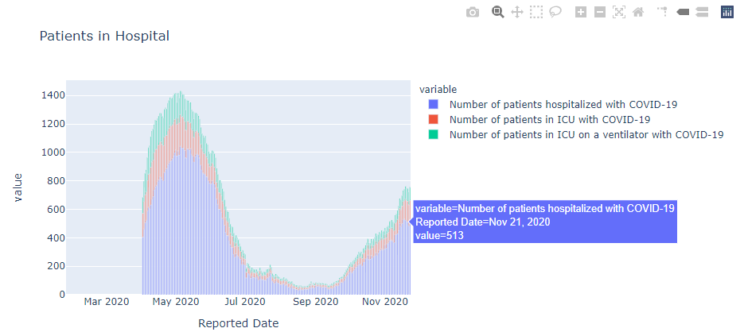

# Covid-19 Tracker in Ontario
- https://covid19ontario.herokuapp.com/
- Developed a simple web app to track daily cases of novel COVID-19 virus in Ontario.
- The web app provides a daily update of cases in Ontario
- It also includes interactive plots of various statistics regarding COVID-19 in Ontario

# Forecast
- Current as of December 3rd 2020, my model forecasts COVID-19 cases in Ontario to roam around the 1500-2400 cases per day margin for the New Year.

# The Dataset
- The dataset used for this tracker is from the Ontario dataset and can be found [here](https://data.ontario.ca/dataset)

# Statistics
- Daily cases in Ontario
- Cases by City
- Patients in Hospital
- Cases by Age Group
- Cases by Acquisition
- Outcome of Cases
- Cases by Gender
- Resolved Vs. Deaths Vs. Total Cases

# Visuals

